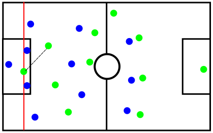
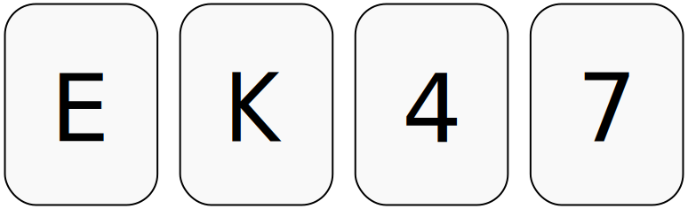

% Boolean Logic, and a bit more besides
% Aidan Delaney
% <a href="mailto:aidan@ontologyengineering.org">aidan@ontologyengineering.org</a> | <a href="http://www.twitter.com/aidandelaney">@aidandelaney</a>

# About Me {data-background='images/royal-pavilion-brighton.jpg'}

* Academic for over a decade (PhD in Logic(ish) i.e. CS involving logic).
* Researcher in Visual Languages and Visual Reasoning.
* Shipped code in Haskell, C, Java, Perl, Python, C++, JavaScript & others.
* Outgoing CAS Regional Co-ordinator for East Sussex & Kent.
* Director of an Eastbourne not-for-profit [__TechResort__](http://techresort.co.uk/)

# Introduction {data-background="#CCCCCC" data-transition="fade-in fade-out"}

# Formalisation {data-background="#f08" data-transition="fade-in fade-out"}

## Reasons for

[](images/offside.svg)

## Rhetoric

<blockquote>
Everyone who is sane can do Logic.
No lunatics are fit to serve on a jury.
None of your sons can do Logic.
Therefore, none of your sons are fit to serve on a jury. --
<cite>_Charles L. Dodgson, Symbolic Logic, 1896_</cite>
</blockquote>

##

$$
(\forall x\; Sane(x) \rightarrow Logical(x)) \wedge\\
(\forall x\; \neg Sane(x) \rightarrow \neg Juror(x)) \wedge\\
(\forall x\; Sons(x) \rightarrow Logical(x)) \rightarrow\\
(\forall x\; \neg Sons(x) \wedge Logical(x))
$$

Note we're not modelling the relationship between __you__ and your sons here.

## Limits of Formalisation

<blockquote>Any sufficiently expressive self-referential system is either inconsistent or incomplete -- <cite>Paraphrasing Kurt Gödel</cite></blockquote>

# Boolean Logic {data-background="#CCCCCC" data-transition="fade-in fade-out"}

## Examples

Boolean logic (a.k.a. Propositional logic) is restrictive in what it can express.

It is useful because

```C
if(a < b || (a >= b && c == d)) ...
```

can be simplified to

```C
if(a < b || c == d)
```

## Syntax of Boolean Logic

----------------- ------------------------
$\top$ and $\bot$ Denote true and false
$P$ and $Q$       Denote propositions
$P\wedge Q$       Denoting conjunction
$P\vee Q$         Denoting disjunction
$\neg P$          Denoting negation
------------------------------------------

Other people define different syntax

## Alternative Syntax

----------------- ------------------------
$1$ and $0$       Denote true and false
$P$ and $Q$       Denote propositions
$P.Q$              Denoting conjunction
$P + Q$           Denoting disjunction
$\overline{P}$    Denoting negation
------------------------------------------

let's call these __terms__.

## Forming Sentences

All terms are sentences.

If $\alpha$ and $\beta$ are sentences then $(\alpha \wedge \beta)$ is a sentence.

Similarly $(\alpha \vee \beta)$ is a sentence.

## Semantics of Boolean Logic

A sentence in Boolean logic evaluates to either __true__ or __false__.

## 'And' diagrammatically

[](images/venn-and.svg)

## 'Or' diagrammatically

[](images/venn-or.svg)

## 'Not' diagrammatically?

Your turn.

# Misunderstandings {data-background="#0075B2" data-transition="fade-in fade-out"}

##

Mostly stem from applying linguistic interpretation of a sentence rather than an logical interpretation.

## 'and'

<blockquote>Aidan bought a motorbike __and__ went to work.</blockquote>

The English sentence has issues

* temporal implicature
* causality

Which is why we formalise in the first place.

## 'or'

<blockquote>Eat your carrots __or__ your peas.</blockquote>

* Exclusive `or` _versus_ inclusive `or`.

Logical __or__ is inclusive.  Exclusive __or__  more precisely translates as

<blockquote>__Either__ eat your carrots __or__ your peas.</blockquote>


## implication

Some people add implication to their set of Boolean connectives.

$P\rightarrow Q$ read as "if P then Q"

This shorthand for $(\neg P \vee Q)$, it causes significant confusion.

## As a diagram

[](images/venn-implication.svg)


# Game Time {data-background="images/god.jpeg"}

##

[](images/implication-cards.svg)

<blockquote>If a card has a vowel on one side, then it has an even number on the other side.</blockquote>

## Reasoning Rules

In light of this game _modus tollens_ and _modus ponens_ make more sense.

modus ponens                                                                  modus tollens
---------------------------------------- --------------------------------------------------
$\frac{\matrix{P\rightarrow Q, P}}{Q}$     $\frac{\matrix{P\rightarrow Q, \neg Q}}{\neg P}$

# First Order Logic {data-background="#fa0" data-transition="fade-in fade-out"}

## Syllogism

All Ducks are Mortal

Aristotle is a Duck

Therefore, Aristotle is Mortal

## Another Game

         1   2    3    4    5
-------- --- ---  ---  ---  ----
All
No
Some
Some Not

Quantifier $P$ are $Q$.

## Self-test

[](images/Newstead-test.svg)

# Misunderstandings

## 'Some'

<blockquote>After the pub, __some__ of us went to the club.</blockquote>

Issues

* linguistic implicature that at least 2 but not all.

## 'All'

<blockquote>Scene: 14 blue circles, 2 blue squares, 3 red squares.

Q: Are all the circles blue?

A: No, there are two blue squares.

<cite>-- Inhelder and Piaget (1959)</cite></blockquote>

## 'All'

<blockquote>Scene: 5 apples and 3 pigs eating 1 apple each.

Q: Every pig is eating an apple . . . Does this picture go with the
story?

A: No. Those two apples have no pig.

<cite>-- Philip and Takahashi (1991)</cite>
</blockquote>

## 'All'

<blockquote>
Scene: 5 cars and 4 garages, each occupied by 1 of the cars.

Q: All the cars are in the garages.

A: Yes.

<cite>-- Donaldson and Lloyd (1974)</cite>
</blockquote>

## 'All'

<blockquote>
Scene: 3 cats holding a balloon, and 1 mouse holding an umbrella.

Q: Is every cat holding a balloon?

A: No.

<cite>-- Philip and Verrips (1994)</cite>
</blockquote>

# Conclusion {data-background="#00d414" data-transition="fade-in fade-out"}

##

* Boolean Logic is a useful system for demonstrating computational thinking.
* A visual approach to Boolean Logic is useful.
* The visual approach extends to First-order logic (and Second-order).
* Learners make consistent types of mistakes -- knowing these allow us to target interventions.

## Thank you {data-background='images/ThankYou.jpg'}

* I'm always happy to answer questions over email.
     - <a href="mailto:aidan@ontologyengineering.org">aidan@ontologyengineering.org</a> | <a href="http://www.twitter.com/aidandelaney">@aidandelaney</a>
* My Youtube Channel has some of this content.
     - [youtube.com/moobarbaz](http://www.youtube.com/moobarbaz)
