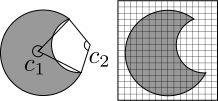

% Drawing Area Proportional Euler Diagrams
% Aidan Delaney
% <a href="mailto:aidan@ontologyengineering.org">aidan@ontologyengineering.org</a> | <a href="http://www.twitter.com/aidandelaney">\@aidandelaney</a>

# About Me {data-background='images/royal-pavilion-brighton.jpg'}

##

* Academic for over a decade (PhD in CS involving logic).
* Researcher in Visual Languages and Visual Reasoning.
* Shipped code in Haskell, C, Java, Perl, Python, C++, JavaScript & others.
* Director of an Eastbourne not-for-profit [__TechResort__](http://techresort.co.uk/).

# AP Euler Diagrams

## Previous Work

  * EulerAPE
  * Wilkinson

## Our Contribution

  * "Standard" algorithms.
  * Use a force model to attract/repel circle centres.

## Vennom

  * Implements the drawing algorithm
  * Key-weakness - calculates area by drawing a bitmap

## Bitmaps

{width=80%}

## Advantages

  * Computationally fast $O(n^2)$, if the bitmap is small.
  * Straightforward to implement.

## Disadvantages

  * Not perfectly accurate.
  * $O(n^2)$ grows poorly.
  * Optimisations cause some corner cases with "holes".

## TODO

  * We need to add good area reporting to Vennom.
  * In about 5 slides time...


# GNU R

## Prevalence

  * Use in Bioinformatics [@croucher:rpaolsorbwgsug]
  * Done well it will *significantly* improve impact.

## Example t-test

Paired t-test:
```r
before = c(12.9, 13.5, 12.8, 15.6, 17.2, 19.2, 12.6, 15.3, 14.4, 11.3)
after  = c(12.7, 13.6, 12.0, 15.2, 16.8, 20.0, 12.0, 15.9, 16.0, 11.1)

t.test(before, after, paired=TRUE)
```

## Example histogram

```r
before = c(12.9, 13.5, 12.8, 15.6, 17.2, 19.2, 12.6, 15.3, 14.4, 11.3)

pdf("myhistogram.pdf")
hist(before)
svg("myhistogram.svg")
hist(before)
```

## More Examples

{width=200px}

  * See [http://www.statmethods.net/](http://www.statmethods.net/) for some good examples.
  * [ggplot2](http://ggplot2.org/) is an *extremely* powerful graphics library for R.
    - The ideas behind ggplot2 are similar to the motivation for the VMG; developing semantics for visualisations (or vice-versa).

## Exensible

  * There exists an "app-store" for R.
  * CRAN: *Comprehensive R Archive Network*.
  * Modelled on CPAN (from 1993!).
  * `ggplot2` and `venneuler` are distributed via CRAN.

## Using VennEuler

```r
library("venneuler")

vd <- venneuler(c(A=0.3, B=0.3, C=1.1, "A&B"=0.1, "A&C"=0.2, "B&C"=0.1 ,"A&B&C"=0.1))
plot(vd)
```

## EuleR wish?
```r
library("euleR")

ed <- euleR(c(A=0.3, B=0.3, C=1.1, "A&B"=0.1, "A&C"=0.2, "B&C"=0.1 ,"A&B&C"=0.1))
plot(ed)
```

Be source compatible!

# Requirements

##

  1. Source compatibility with venneuler.
  2. Distributable via CRAN.
  3. Calculate area more accurately than vennom.

# Two Architectures

## Monolith

  * Use RJava
  * Bundle vennom, area calculation and R-bridge as CRAN package.
  * Manually manage transitive dependencies

## Web Service

  * Require Internet connection.
  * Move R-bridge, vennom, area calculation an dependencies to cloud.
  * Allows _tracking_ or user requests.

## Debugging

# Area Calculation

## Inkscape inspired

## JavaGeom

## Our Solution

# Conclusion

## Examples

## Development

  * The *supposed* hard bits were easy.
  * The *easy* bit -- area calculation -- is surprisingly involved.
  * The core vennom algorithm needs improvement.
  * Development -- i.e. impact -- is a full-time commitment.

# References
