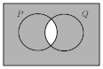
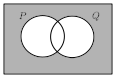

% Boolean Logic
% Aidan Delaney
% <a href="mailto:aidan@ontologyengineering.org">aidan@ontologyengineering.org</a> | <a href="http://www.twitter.com/aidandelaney">\@aidandelaney</a>

# Boolean Logic {data-background="#CCCCCC" data-transition="fade-in fade-out"}

## Examples

Boolean logic (a.k.a. Propositional logic) is restrictive in what it can express.

It is useful because

```C
if(a < b || (a >= b && c == d)) ...
```

can be simplified to

```C
if(a < b || c == d)
```

## Syntax of Boolean Logic

----------------- ------------------------
$\top$ and $\bot$ Denote true and false
$P$ and $Q$       Denote propositions
$P\wedge Q$       Denoting conjunction
$P\vee Q$         Denoting disjunction
$\neg P$          Denoting negation
------------------------------------------

Other people define different syntax

## Alternative Syntax

----------------- ------------------------
$1$ and $0$       Denote true and false
$P$ and $Q$       Denote propositions
$P.Q$              Denoting conjunction
$P + Q$           Denoting disjunction
$\overline{P}$    Denoting negation
------------------------------------------

let's call these __terms__.

## Forming Sentences

All terms are sentences.

If $\alpha$ and $\beta$ are sentences then $(\alpha \wedge \beta)$ is a sentence.

Similarly $(\alpha \vee \beta)$ is a sentence.

## Semantics of Boolean Logic

A sentence in Boolean logic evaluates to either __true__ or __false__.

## 'And' diagrammatically

[](images/venn-and.svg)

## 'Or' diagrammatically

[](images/venn-or.svg)

## 'Not' diagrammatically?

[](images/venn-not.svg)

# Misunderstandings {data-background="#0075B2" data-transition="fade-in fade-out"}

##

Mostly stem from applying linguistic interpretation of a sentence rather than an logical interpretation.

## 'and'

<blockquote>Aidan bought a motorbike __and__ went to work.</blockquote>

The English sentence has issues

* temporal implicature
* causality

Which is why we formalise in the first place.

## 'or'

<blockquote>Eat your carrots __or__ your peas.</blockquote>

* Exclusive `or` _versus_ inclusive `or`.

Logical __or__ is inclusive.  Exclusive __or__  more precisely translates as

<blockquote>__Either__ eat your carrots __or__ your peas.</blockquote>


## implication

Some people add implication to their set of Boolean connectives.

$P\rightarrow Q$ read as "if P then Q"

This shorthand for $(\neg P \vee Q)$, it causes significant confusion.

## As a diagram

[](images/venn-implication.svg)


# Conclusion {data-background="#00d414" data-transition="fade-in fade-out"}

##

* Boolean Logic is a useful system for demonstrating computational thinking.
* A visual approach to Boolean Logic is useful.
* The visual approach extends to First-order logic (and Second-order).
* Learners make consistent types of mistakes -- knowing these allow us to target interventions.

## Thank you 

* I'm always happy to answer questions over email.
     - <a href="mailto:aidan@ontologyengineering.org">aidan@ontologyengineering.org</a> | <a href="http://www.twitter.com/aidandelaney">@aidandelaney</a>
